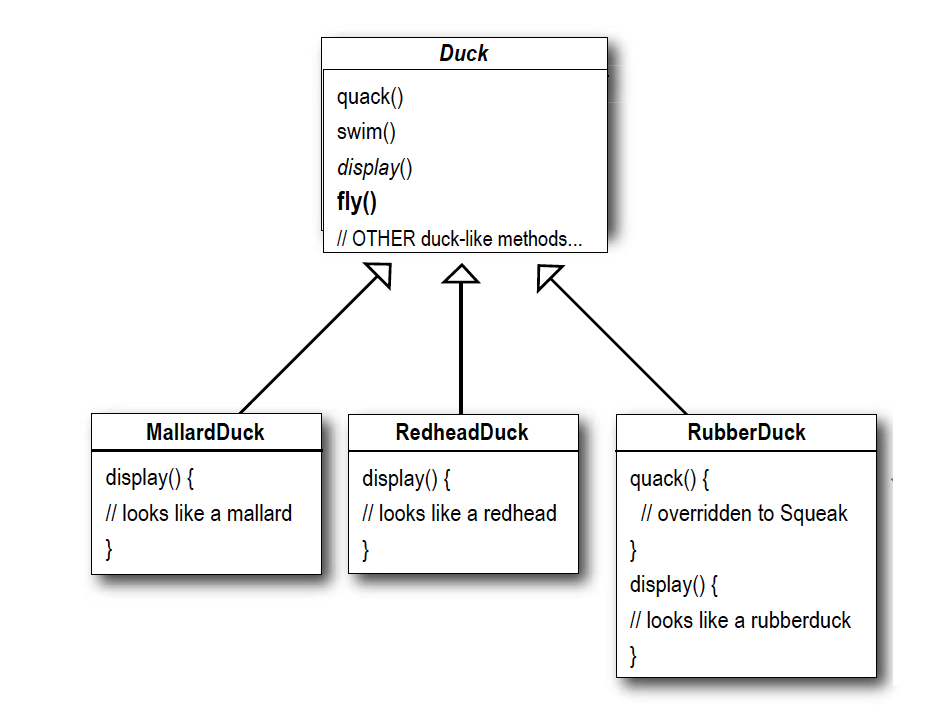
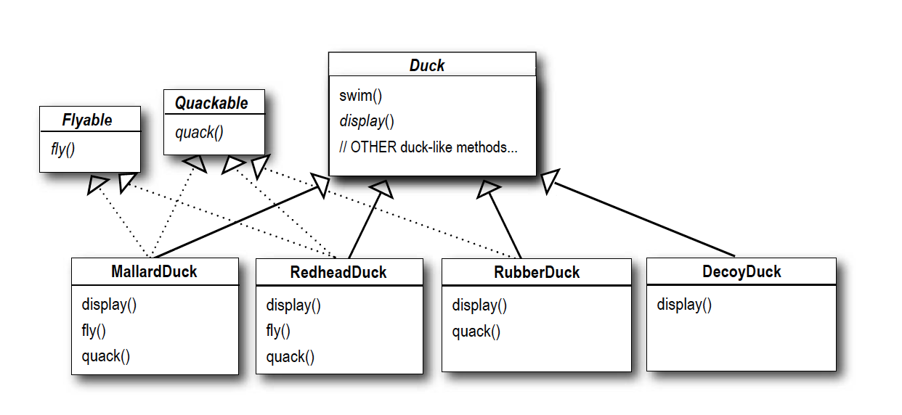
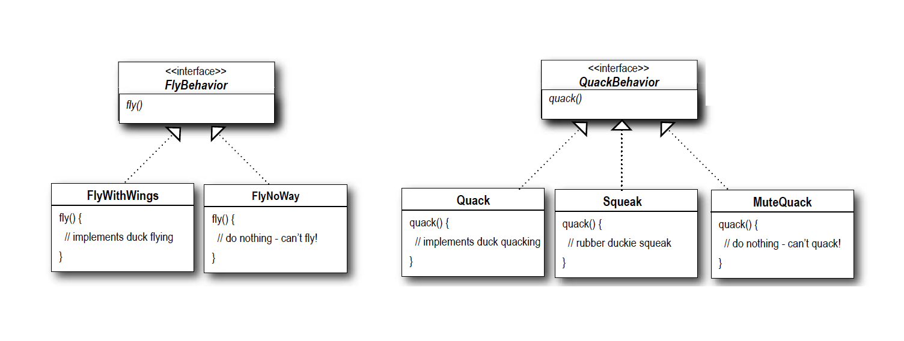
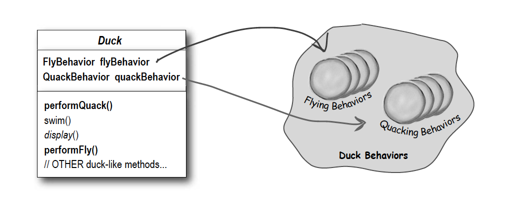
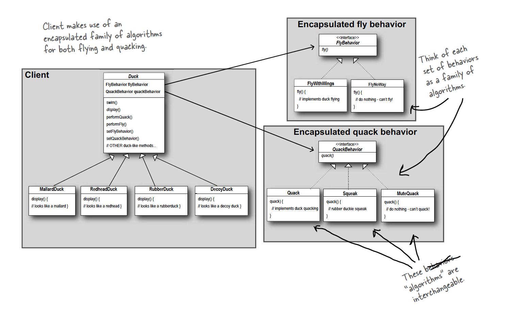

### OOD and System Design
<br/>

|  | OOD | System Design |
| ----------- | ----------- |----------- |
| 面试者 | 应届生，校招，SDE1 | 3y+经验者，社招，SDE2 |
| 考查要点 | 需要写代码，考察从场景中抽象对象的能力 | 复杂系统设计，业务理解，bottleneck分析 |
| 常见公司| Amazon, Bloomberg |  Google, Facebook |
| 关键词 | Viability | Scalability |
| 例题 | Design Parking Lot | Design Tiny URL |
| 如何区分 | 一定是单机，围绕类与类的关系 | 一定会提到分布式系统，重点在稳定性和延展性 |
<br/>

### Java Quick Start
<br/>

**i. `Class`**

```Java
public class People {
    // public members
    public String name;
    public String gender;
    // private member
    private int bankBalance;

    // constructor
    public People(String name) {
        this.name = name
    }

    public void speak() {
        // blablabla
    }
}
```

instantiate people
```Java
People trump = new People("Trump");
trump.speak();
```
</br>

**ii. `Interface`**

所有function都是abstract，不能包含function实现

```Java
public interface Walkable {
    public void walk();
}

public interface Swimmable {
    public void swim();
}
```

关键字`implements`表示实现关系
```Java
public class People implements Walkable, Swimmable {
    @Override
    public void walk() {
        // walk
    }

    @Override
    public void swim() {
        // swim
    }
    ...
}
```

instantiate people
```Java
People trump = new People("Trump");
trump.walk();
trump.swim();
```

Class A 实现 Interface B, C 表示 "A has B" 和 “A has C"，为组合关系（A组合了B和C的功能/性质）

</br>

**iii. `extends`**
```Java
class Country {
    public String country = "Japan";
    ...
}

class City extends Country {
    public String city = "Tokyo";
    ...
}
```
```Java
City tokyo = new City();
System.out.println(tokyo.country);
```
Class A 继承 Class B 表示 "A is B", 为继承关系（只允许单一继承）

</br>

**iv. Polymorphism(多态)**
```Java
public interface Animal {
    public void makeSound();
}

public class Dog() implements Animal {
    @Override
    makeSound() {
        bark();
    }
}

public class Cat() implements Animal {
    @Override
    makeSound() {
        meow();
    }
}
```
get animal and make sound
```Java
public static void myPet(Animal it) {
    it.makesound();
}

Animal it = new Cat();
myPet(it);
```
该例子展现了面向接口编程的优点：提高编程的灵活性

</br>

**v. Best Practice**

设计原则：多用组合(composition)，少用继承(inheritance)

</br>

### Example: Duck
</br>
Considering `Duck` as a specie, we have three subspecies of `Duck`: MallardDuck, ReadheadDuck, RubberDuck

</br>

If we use inheritence as following, we grant flying ability to all ducks, including those that shoudn't (RubberDuck)



</br>

If we use interface, the problem is we need to implements each interface multiple times for all these ducks (a lot of redundent work).


</br>

An elegant design will be using behavior interface, and have individual implementation for each interface.



</br>

And in the `Duck` class, we define behavior as a memeber/property of `Duck`


</br>

Fly interface
```Java
public interface FlyBehavior {
    public void fly();
}
```

</br>

Fly implementation
```Java
public class FlyWithWings implements FlyBehavior {
    public void fly() {
        // can fly
    }
}

public class FlyNoWay implements FlyBehavior {
    public void fly() {
        // cannot fly
    }
}
```

</br>

Duck Absturct Hyper Class
```Java
public abstract class Duck {
    FlyBehavior flyBehavior;
    QuackBehavior quackBehavior;
    // constructor
    public Duck() {}

    public abstract void display();

    public void performFly() {
        flyBehavior.fly();
    }

    public void performQuack() {
        quackBehavior.quack();
    }
}
```

</br>

One of a Duck specie
```Java
public class ModelDuck extends Duck {
    public ModelDuck() {}
    public void display() {
        // display model duck
    }

    void setFlyBehavior(FlyBehavior flyBehavior) {
        this.flyBehavior = flyBehavior
    }

    void setQuackBehavior(QuackBehavior quackBehavior) {
        this.quackBehavior = quackBehavior
    }
}
```

</br>

Overall UML diagram
