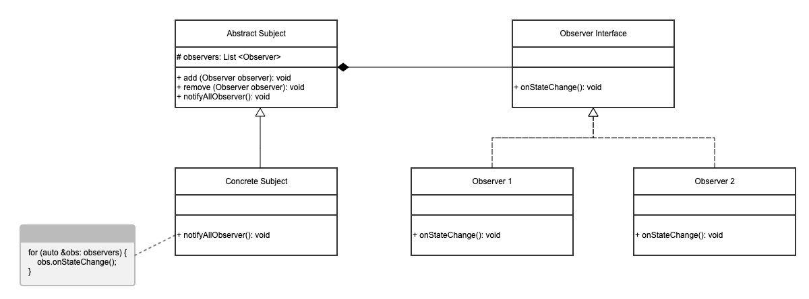
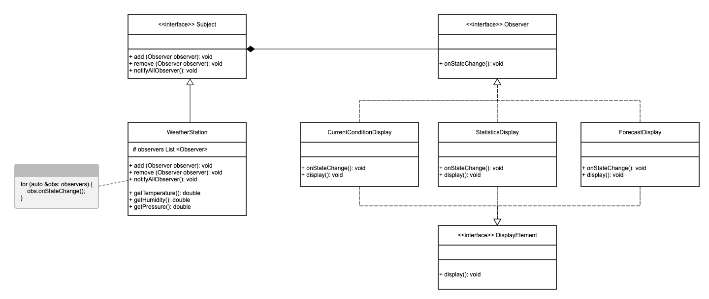
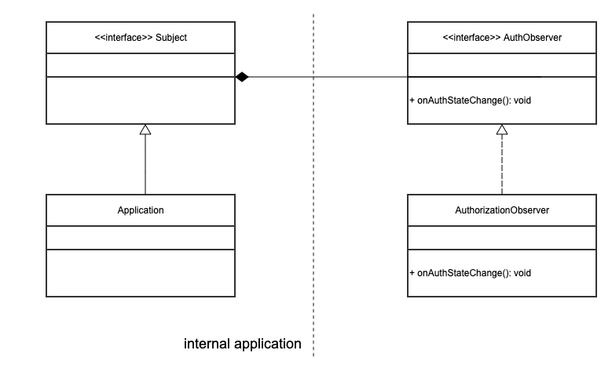
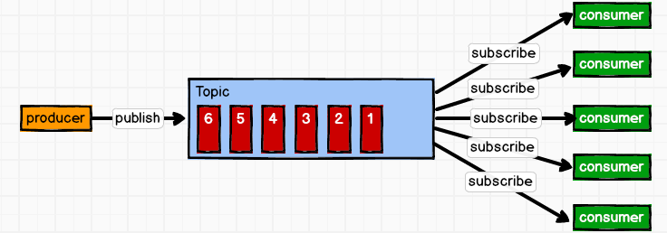

## Chapter 1: Observer Pattern 观察者模式

</br>

**NOTE**: 设计模式和语言无关，因此介绍中跳过所有仅限Java的特性和类，例如 `java.util.Observable` 类

</br>


对象 `Object` 不是独立存在的，一个对象的状态 `state` 发生改变可能会使一个或者多个其他对象的状态也发生改变。例如，某商品的价格上涨会使商家 `producer` 开心，而使消费者 `consumer` 难过；开车到交叉路口时，遇到红灯会停，遇到绿灯会行。

</br>

## 1. Definition

观察者模式 `Observer Pattern` 定义：指多个对象间存在**一对多**的依赖关系，当一个对象的状态发生改变时，所有依赖于它的对象都得到通知并被**自动更新**。这种模式有时又称作 发布-订阅`Publish-Subscribe`模式 (参考[Google Cloud pubsub](https://cloud.google.com/pubsub/docs/overview))、模型-视图`Model-View`模式 (参考[MVC](https://zh.m.wikipedia.org/zh-hans/MVC#:~:text=MVC%E6%A8%A1%E5%BC%8F%EF%BC%88Model%E2%80%93view%E2%80%93,%E5%92%8C%E6%8E%A7%E5%88%B6%E5%99%A8%EF%BC%88Controller%EF%BC%89%E3%80%82))，它是对象行为型模式。

</br>


</br>

## 2. Design UML

</br>



</br>

> Abstract Subject(抽象主题)：抽象目标类，它有一个用于保存观察者对象的 collection 和 两个 add，delete 观察者对象的方法。它还有一个通知所有观察者的抽象方法(abstract method)。

</br>

> Concrete Subject(具体主题)：具体目标类，它继承抽象目标类，实现抽象目标中的 `notifyAllObserver`方法，当具体主题的内部状态发生改变时，通知所有注册过的观察者对象。

</br>

> Observer interface(抽象观察者)：它是一个abstact class或interface，它提供了一个更新状态`onStateChange`的抽象方法，当接到具体主题的通知`notifyAllObserver`时被调用。

</br>

> Concrete Observer(具体观察者)：实现抽象观察者中定义的`onStateChange`方法，在得到具体主题的更改通知时更新自身的状态。

</br>

在 Observer Pattern 中，我们可以创建多个观察者对象，每个观察者可以有不同的观察侧重点（只对状态中的一部分变量感兴趣），对状态变化也可以做出不同的反应。

</br>

## 3. Design Example

</br>

### 3.1 Weather Station

</br>

有一个气象站，该气象站有多个传感器，可实时更新当前天气状况，并使用 `WeatherData` 对象追踪天气变化。该气象站希望建立三个布告板，分别显示当前天气(温度，湿度)，气象统计信息，和简单的天气预报。

</br>

### i. 错误示范

</br>

```Java
public class WeatherStation {
    public void onMeasurementsChanged() {
        WeatherData data = getWeatherData(); // 拿到当前天气数据
        float temp = data.getTemperature();
        float humidity = data.getHumidity();
        float pressure = data.getPressure();
        
        // 更新三个布告板
        currentConditionsDisplay.update(temp, humidity, pressure);
        statisticsDisplay.update(temp, humidity, pressure);
        forecastDisplay.update(temp, humidity, pressure);
    }
    // other WeatherData methods here
}
```

</br>

错误示范使用面向实现编程 (coding to concrete implementation, not interface)，当需要添加/删除新的布告板时，需要修改 `onMeasurementsChanged`，无法在运行时动态添加/删除。此外，每个布告板的 `update` 使用同样的参数，被调用了三次，代码有重复。

</br>

### ii. 使用观察者模式

</br>



</br>

Interfaces
```Java
public interface Subject {
    public void registerObserver(Observer o);
    public void removeObserver(Observer o);
    public void notifyObservers();
}

public interface Observer {
    public void onStateChange(float temp, float humidity, float pressure);
}

public interface DisplayElement {
    public void display();
}
```

Weather Station
```Java
public class WeatherStation implements Subject {
    private ArrayList observers; // 存储所有注册的观察者
    private float temperature;
    private float humidity;
    private float pressure;

    // constructor
    public WeatherStation() {
        observers = new ArrayList(); // 一个List
    }

    public void registerObserver(Observer obs) {
        observers.add(obs);
    }
    
    public void removeObserver(Observer obs) {
        int index = observers.indexOf(obs);
        if (index >= 0) {
            observers.remove(index);
        }
    }

    public void notifyAllObservers() {
        for (Observer obs: observers) {
            obs.onStateChange(temperature, humidity, pressure);
        }
    }

    public void onMeasurementsChanged() {
        WeatherData data = getWeatherData(); // 拿到当前天气数据
        temperature = data.getTemperature();
        humidity = data.getHumidity();
        pressure = data.getPressure();
        notifyAllObservers();
    }

    // other WeatherData methods here
}
```
</br>

### 3.2 Authorization Observer

</br>

serverless的服务一般提供了 `AuthorizationObserver` 接口，用户使用该接口收听 authorization 状态。（参考[Google Firebase](https://firebase.google.com/docs/auth/web/start#set_an_authentication_state_observer_and_get_user_data)）



</br>

### 3.3 Kafka Subscription

</br>

Kafka 是一种消息缓存队列，其中一种一对多的注册模式如下。生产者向 Kafka 推送消息，注册的消费者收到 Kafka 的通知后拉取消息。


</br>

## 4. Pros and Cons

</br>

> Pros:
> 1. 降低了目标与观察者之间的耦合关系，两者之间是抽象耦合关系。
> 2. 目标与观察者之间建立了一套触发机制。

</br>

> Cons:
> 1. 目标与观察者之间的依赖关系并没有完全解除，而且有可能出现循环引用。
> 2. 当观察者对象很多时，通知的发布会花费很多时间，影响程序的效率。

</br>

## 5. Pull or Push

</br>

当使用 `notifyAllObserver()` 通知所有注册的观察者时，可以使用两种方式传递相关数据(比如天气信息)

</br>

### i. Push

</br>

由`subject`主动传递数据。在调用`notifyAllObserver(Object obj)`时，主动传递数据，气象站的例子使用了这种方法。

</br>

### ii. Pull

</br>

观察者接到通知后，由观察者主动从`subject`拉取它需要的数据，`notifyAllObserver()` 并不传递任何数据。`subject`中可定义`get()`方法供观察者使用。

</br>

两种方法都可以使用。`Push`一次性传递了所有状态信息，简化了流程，但每个观察者可能会拿到多余信息。`Pull`提供了细粒度的方法，每个观察者可根据自身所需从主体获得信息，但这样会频繁调用主体，增加计算花销。
