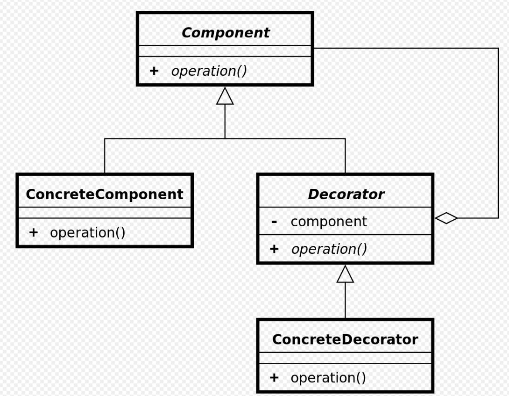
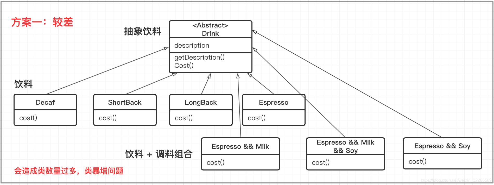
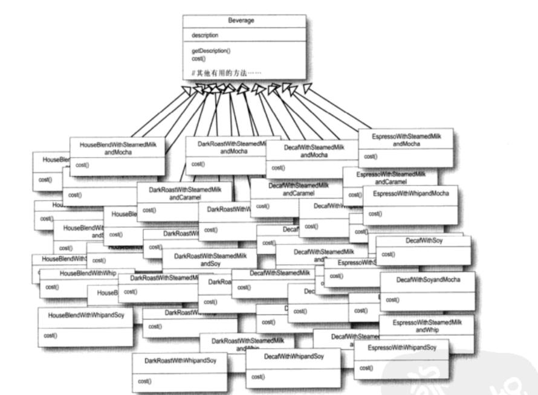
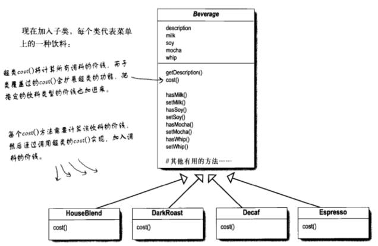
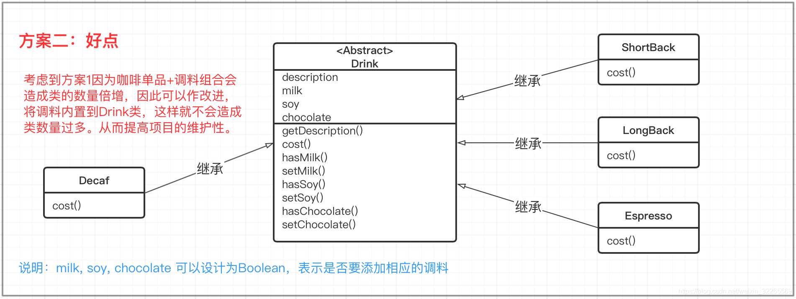
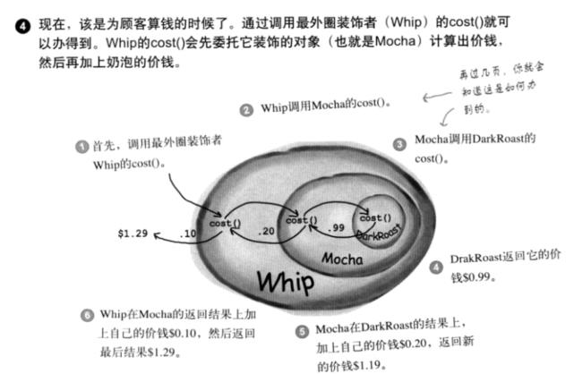
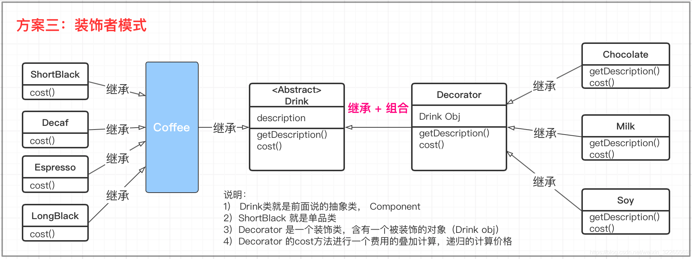
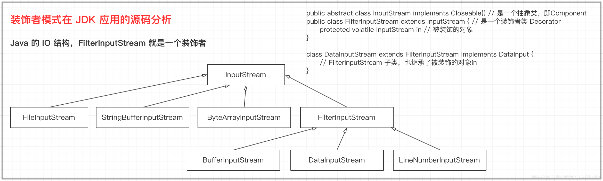

## Chapter 2: Decorator Pattern 装饰（者）模式
<div align=center>
	
</div>


</br>
通常可以使用继承来实现功能的扩展，如果这些需要扩展的功能的种类很繁多，那么势必生成很多子类，增加系统的复杂性，同时使用继承实现功能拓展，我们必须可预见这些拓展功能，这些功能是编译时就确定了，是静态的。

</br>
动态地给一个对象添加一些额外的职责，就增加功能来说，装饰模式比生成子类更灵活。

</br>

## 1. Definition

通过使用修饰模式，可以在运行时扩充一个类别的功能。原理是：增加一个修饰类包裹原来的类别，包裹的方式是在修饰类的构造函数中将原来的类以参数的形式传入。装饰类实现新的功能，但是，在不需要用到新功能的地方，它可以直接调用原来的类别中的方法。修饰类必须和原来的类别有**相同的接口**。

修饰模式是类别**继承**的另外一种选择。类继承在编译时候增加行为，而装饰模式是在**运行时**增加行为。(参考[wiki/修饰模式](https://zh.wikipedia.org/wiki/%E4%BF%AE%E9%A5%B0%E6%A8%A1%E5%BC%8F))


</br>

## 2. Design UML

</br>



</br>

> 抽象构件(Component)角色：给出一个抽象接口，以规范准备接收附加责任的对象。

</br>

> 具体构件(ConcreteComponent)角色：定义一个将要接收附加责任的类。

</br>

> 具体装饰(ConcreteDecorator)角色：负责给构件对象“贴上”附加的责任。

</br>

在 Decorator Pattern 中，我们也可以创建多个装饰者对象，不过每个装饰者对象都要和构件有者相同接口，但是可以做出不同的反应。

</br>

## 3. Design Example

</br>

### 3.1 Starbuzz Coffee

</br>

星巴克的咖啡可以加入各种调料如奶泡，豆奶，摩卡等等。不同的调料有着不同的收费。

</br>

### i. 错误示范
</br>
方案1：咖啡单品+调料组合





</br>
问题分析

</br>

> 1. 单品咖啡+调料组合过多


</br>
方案2：调料为算法




</br>
问题分析

</br>

> 1. 方案 2 可以控制类的数量，不至于造成很多的类。
> 2. 在增加或者删除调料种类时，代码的维护量很大。

</br>

### ii. 使用装饰模式

</br>
对一个主体：打包，嵌套，递归。




</br>

AbstractDrink 源码示例：

```Java
public abstract class AbstractDrink {
 
    public String des; // 描述
    private float price = 0.0f;
 
    public void setDes(String des) {
        this.des = des;
    }

    public String getDes() {
        return des;
    }

    public void setPrice(float price) {
        this.price = price;
    }
 
    public float getPrice() {
        return price;
    }
 
    // 计算费用的抽象方法
    // 子类来实现
    public abstract float cost();
}
```

Coffee 源码示例：
```Java
public class Coffee extends AbstractDrink {
    @Override
    public float cost() {
        return super.getPrice();
    }
}
```

Espresso 源码示例：
```Java
public final class LongBlack extends Coffee {
    public LongBlack() {
        setDes(" 澳式黑咖啡 ");
        setPrice(6.0f);
    }
}
```

Decorator 源码示例：
```Java
public class Decorator extends AbstractDrink {
    private AbstractDrink drink;
 
    public Decorator(AbstractDrink drink) { // 组合
        this.drink = drink;
    }

    @Override
    public float cost() {
        // getPrice 自己价格
        return super.getPrice() + drink.cost();
    }
 
    @Override
    public String getDes() {
        // drink.getDes()  输出被装饰者的信息
        return super.des + " " + getPrice() + " && " + drink.getDes();
    }
}
```

Milk 源码示例：
```Java
public class Milk extends Decorator {
    public Milk(AbstractDrink drink) {
        super(drink);
        setDes(" 牛奶 ");
        setPrice(2.0f);
    }
}
```

CoffeeBar 源码示例：
```Java
public class CoffeeBar {
    public static void main(String[] args) {
        // 装饰者模式下的订单：2份巧克力 + 一份牛奶的LongBlack
 
        // 1. 点一份 LongBlack
        AbstractDrink order = new LongBlack();
        System.out.println("费用1=" + order.getPrice());
        System.out.println("描述=" + order.getDes());
 
        // 2. order 加入一份牛奶
        order = new Milk(order);
        System.out.println("order 加入一份牛奶 费用 = " + order.cost());
        System.out.println("order 加入一份牛奶 描述 = " + order.getDes());
 
        // 3. order 加入一份巧克力
        order = new Chocolate(order);
        System.out.println("order 加入一份巧克力 费用 = " + order.cost());
        System.out.println("order 加入一份巧克力 描述 = " + order.getDes());
 
        // 4. order 加入2份巧克力
        order = new Chocolate(order);
        System.out.println("order 加入2份巧克力 费用 = " + order.cost());
        System.out.println("order 加入2份巧克力 描述 = " + order.getDes());
 
        System.out.println("======================================");
 
        AbstractDrink order2 = new Decaf();
        System.out.println("order2 无因咖啡 费用 = " + order2.cost());
        System.out.println("order2 无因咖啡 描述 = " + order2.getDes());
 
        order2 = new Milk(order2);
        System.out.println("order2 无因咖啡 加入一份牛奶 费用 = " + order2.cost());
        System.out.println("order2 无因咖啡 加入一份牛奶 描述 = " + order2.getDes());
 
    }
}
```

</br>

### 3.2 JAVA IO FilterInputStream 

</br>

Java 的 IO 结构，FilterInputStream 就是一个装饰者




</br>
例子：


</br>

应用：大写转换为小写
```Java
import java.io.FileInputStream;
import java.io.FilterInputStream;
import java.io.IOException;
import java.io.InputStream;

public class Demo {
	public static void main(String[] args) {
		try {
			ToLowerInputStream in = new ToLowerInputStream(new FileInputStream(".\\iotest.txt"));
			int c;
			while((c = in.read()) != -1) {
				System.out.print((char) c);			
			}
			in.close();
		} catch (IOException e) {
			e.printStackTrace();
		}
	}
}
 
 
/** 
* 转小写字母
*/ 
class ToLowerInputStream extends FilterInputStream{
 
	protected ToLowerInputStream(InputStream arg0) {
		super(arg0);
		// TODO Auto-generated constructor stub
	}
	
	public int read() throws IOException {
		int c = 0;
        if ((c = super.read()) != -1) {
            if (Character.isUpperCase(c)) {//把大写字母转成小写
                return Character.toLowerCase(c);
            } else {//其他保持
                return c;				
            }			
        }
        else {
            return -1;			
        }
	}	
}
```

</br>

## 5. Applying
</br>
装饰者模式何时使用

> 1. 在不想增加很多子类的情况下扩展类时

</br>
装饰者模式方法

> 1. 将具体功能职责划分，同时继承装饰者模式
</br>

装饰者模式优点

> 1. 装饰类和被装饰类可以独立发展，而不会相互耦合。它有效地把类的核心职责和装饰功能分开了
> 1. 装饰模式是继承关系的一个替代方案
> 1. 装饰模式可以动态地扩展一个实现类的功能

</br>
装饰者模式缺点

> 1. 多层装饰比较复杂。比如我们现在有很多层装饰，出了问题，一层一层检查，最后发现是最里层的装饰出问题了，想想工作量都害怕

</br>
装饰者模式使用场景

> 1. 需要扩展一个类的功能时
> 1. 需要动态地给一个对象增加功能，并可以动态地撤销时
> 1. 需要为一批的兄弟类进行改装或加装功能时

</br>
装饰者模式应用实例

> 1. 旧机包装成新机，手机/电脑内部配件不变，只是换个外壳
> 1. 换衣小游戏，人还是那个人，不断给她换衣服，还可以一层套一层的
> 1. 孙悟空有72变，变成什么后就有了它的功能，但本质还是一只猴子

</br>

## 6. References

</br>

[设计模式 —— 装饰者模式](https://blog.csdn.net/weixin_32265569/article/details/108355392?ops_request_misc=%257B%2522request%255Fid%2522%253A%2522165919192416781683923106%2522%252C%2522scm%2522%253A%252220140713.130102334..%2522%257D&request_id=165919192416781683923106&biz_id=0&utm_medium=distribute.pc_search_result.none-task-blog-2~all~top_positive~default-1-108355392-null-null.142^v35^pc_search_result_control_group&utm_term=%E8%A3%85%E9%A5%B0%E6%A8%A1%E5%BC%8F&spm=1018.2226.3001.4187)
