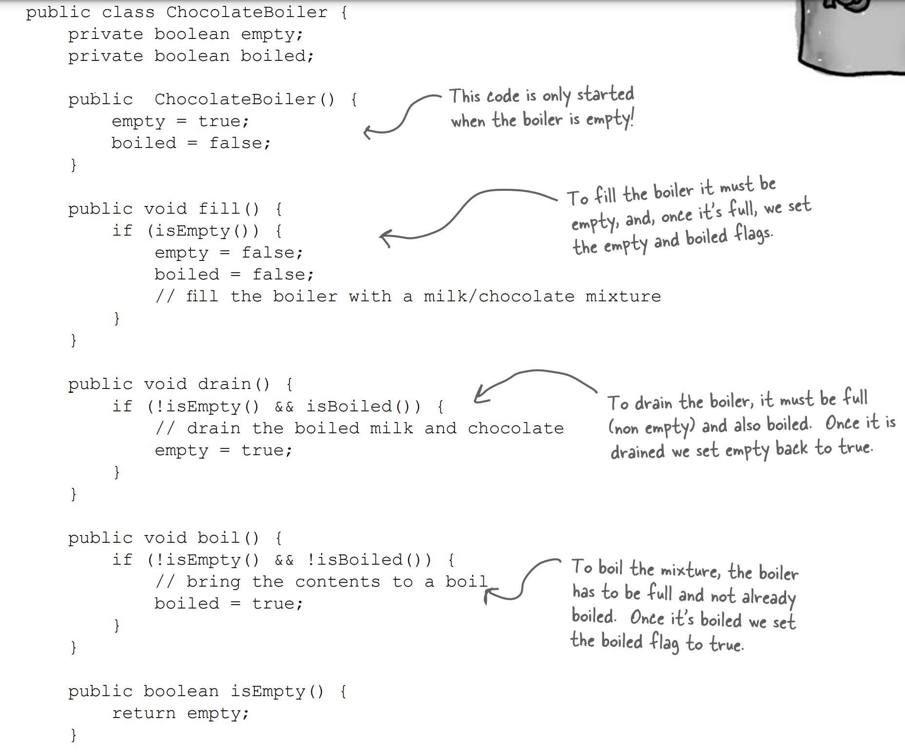
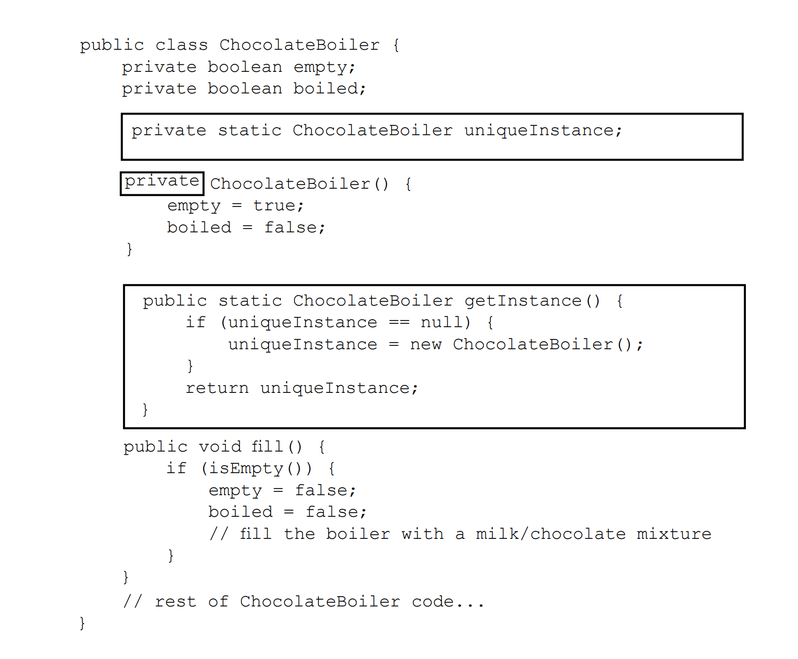
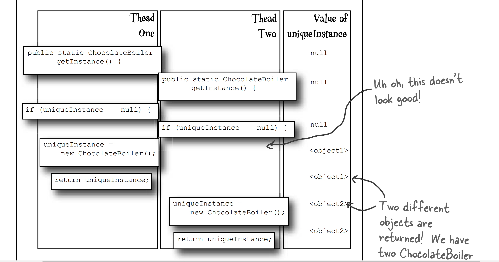
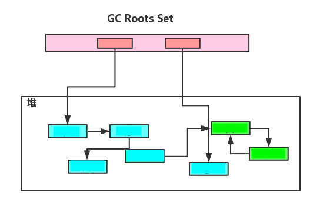

## Chapter 4: Singleton Pattern 单件模式

</br>

<div align=center>
	
</div>

</br>

## 1. Definition

</br>

单件模式(Singleton Pattern)确保每一个类(Class)只有一个实例(Instance), 并提供一个全局访问点(global point of access)。

</br>

### 1.1 A Simple Example

</br>

```Java
public class Singleton {
    private static Singleton uniqueInstance;
    
    private Singleton(){}
    
    public static Singleton getInstance() {
        if (uniqueInstance == null) {
            uniqueInstance = new Singleton();
        }
        return uniqueInstance;
    } 
}
```

</br>

## 2.Why Using it

</br>

### 2.1 Without Singleton Pattern

</br>

多个Object可能会造成Reference混乱。


</br>

### 2.2 With Singleton Pattern

</br>

单件模式保证只有一个实例(instance)存在。许多时候整个系统只需要拥有一个的全局对象(Global Object)，这样有利于我们协调系统整体的行为。

</br>

一个class能return object一个reference(永远是同一个)和一个获得该instance的方法（必须是static方法，通常使用getInstance这个名称。当我们调用这个方法时，如果class持有的reference不为空就return这个reference，如果class保持的reference为空就创建该instance of the class并将instance的reference赋予这个class保持的reference。**同时我们还将该class的constructor定义为 `private`**，这样其他处的代码就无法通过调用该class的constructor来实例化该the object of the class，只有通过这个class提供的static方法来得到该class的唯一instance。

</br>

（一个类能返回对象一个引用(永远是同一个)和一个获得该实例的方法。必须是静态方法，通常使用getInstance这个名称。当我们调用这个方法时，如果类持有的引用不为空就返回这个引用，如果类保持的引用为空就创建该类的实例并将实例的引用赋予该类保持的引用；同时我们 还将该类的构造函数定义为**私有方法**，这样其他处的代码就无法通过调用该类的构造函数来实例化该类的对象，只有通过该类提供的静态方法来得到该类的唯一实例）


</br>

## 3. Singleton Pattern Under Multithreading

</br>

要小心Multithreading的情况下，可能会产生多个objects.



</br>

### 3.1 How to resolve it

</br>

通过加上 synchronized，每个线程在进入这个方法前需要等别的线程离开。不会有两个线程同时进入。但是因为每次都会 synchronize，会拖垮性能。

</br>

```Java
public class Singleton {
    private static Singleton uniqueInstance;
    // other useful instance variables here
    private Singleton() {}
    public static synchronized Singleton getInstance() {
        if (uniqueInstance == null) {
            uniqueInstance = new Singleton();
        }
        return uniqueInstance;
    }
    // other useful methods here
}
```
</br>

还可以用eagarly created instance, 一开始就创建，保证在thread
访问static uniqueInstance variable之前。

</br>

```Java
public class Singleton {
    private static Singleton uniqueInstance = new Singleton();
    private Singleton() {}
    public static Singleton getInstance() {
        return uniqueInstance;
    }
}
```

</br>

也可以用double-checked locking, 这样会检查instance是否已经创建了，如果还没创建，再synchronize

</br>

```Java
public class Singleton {
    private volatile static Singleton uniqueInstance;
    private Singleton() {}
    public static Singleton getInstance() {
        if (uniqueInstance == null) {
            synchronized (Singleton.class) {
                if (uniqueInstance == null) {
                    uniqueInstance = new Singleton();
                }
            }
        }
        return uniqueInstance;
    }
}
```
</br>

## 4. Pros/Cons
优点： 
    
    1.只有一个instance，确保所有的object都访问一个instance 

    2.单例模式具有一定的伸缩性，类自己来控制实例化进程，类就在改变实例化进程上有相应的伸缩性。 

    3.提供了对唯一instance的受控访问。 

    4.由于在系统内存中只存在一个object，因此可以节约系统资源，当需要频繁创建和销毁的object时, 可以提高系统的性能。

    5.允许可变数目的instance。 

    6.避免对共享资源的多重占用。

</br>
缺点： 

    1.不适用于变化的object，如果同一类型的object总是要在不同的场景发生变化，singleton就会引起数据的错误，不能保存彼此的状态。

    2.由于没有abstract layer，因此很难extends。

    3.Singleton的职责过重，在一定程度上违背了“单一职责原则”。

    4.滥用单例将带来一些负面问题，如为了节省资源将数据库连接池对象设计为的单例类，可能会导致共享连接池object的程序过多而出现连接池overflow；如果定义了instance的object长时间不被利用，系统会认为是垃圾而被回收，这将导致object状态的丢失。

</br>

## Appendix: Garbage Collection

</br>

Garbage Collection(GC) 中文直译垃圾回收，是一种回收内存空间避免内存泄漏的机制。当Java虚拟机(JVM)内存紧张时，通过执行 GC 有效回收内存，转而分配给新对象从而实现内存的再利用。 JVM GC 机制虽然无需开发主动参与，减轻不少工作量，但是某些情况下，自动 GC 将会导致系统性能下降，响应变慢。

</br>

### i.什么是垃圾

</br>

```Java
public void eatPizza() {
    Pizza p = new Pizza("cheese");
    Customer me = new Customer();
    me.eat(p);
}
```

方法结束后，内部局部变量会被自动销毁。但是这样仅仅销毁了局部变量(stack上的引用被销毁)，却没有带走内存上这些实际的对象(new 方法创建在heap上的内存没有被销毁)。这些内存中的对象没有被引用(将来也不会被引用)，将其归类为垃圾。

</br>

### ii. GC标记法

</br>

垃圾回收之前需要准确将对象标记出来，分为存活对象与垃圾对象。

</br>

> a. 引用计数法

</br>

引用计数法通过在对象头分配一个字段，用来存储该对象引用计数。一旦该对象被其他对象引用，计数加 1。如果这个引用失效，计数减 1。当引用计数值为 0 时，代表这个对象已不再被引用，可以被回收。


</br>
引用计数法只需要判断计数值，所以实现比较简单，这个过程也比较高效。但是存在一个很严重的问题，无法解决对象循环引用问题。


</br>

> b. 可达性(reachability)分析法

</br>

这个算法首先需要按照规则查找当前活跃的引用，将其称为 GC Roots。接着将 GC Roots 作为根节点出发，遍历对象引用关系图，将可以遍历（可达）的对象标记为存活，其余对象当做无用对象。



</br>

从上图可以看到，绿色对象虽然存在循环引用，但是由于这些对象不能被 GC Roots 遍历到，所以将会被回收。

</br>

### iii. 怎么回收

</br>

> a. 标记-清除算法

</br>

标记：通过上述 GC Roots 标记出可达对象。
清除：清理未标记对象。


</br>

可以看到经过这个算法回收之后，虽然堆空间被清理出来，但是也产生很多空间碎片。这就会导致一个新对象根据堆剩余容量计算，看起来是可以分配，但是实际分配过程，由于没有连续内存，导致虚拟机感知到内存不足，又不得不提前再次触发 GC。

</br>

可能这里你就会有疑惑，为什么对象需要分配一块连续的内存？


</br>

另外这个算法还有一个不足：标记与清除效率比较低。这就竟会导致 GC 占用时间过长，影响正常程序使用。

</br>

> a. 复制算法

</br>

为了解决上述效率问题，诞生复制算法。这个算法将可用内存分为两块，每次只使用其中一块，当这一块内存使用完毕，触发 GC ，将会把存活的对象依次复制到另外一块上，然后再把已使用过的内存一次性清理。


</br>

这个算法每次只需要操作一半内存，GC 回收之后也不存在任何空间碎片，新对象内存分配时只需要移动堆顶指针，按顺序分配内存即可，实现简单，运行高效。但是这个算法闲置一半内存空间，空间利用效率不高。

</br>

另外对象存活率也会影响复制算法效率。如果对象大部分都是朝生夕死，只需要移动少量存活对象，就能腾出大部分空间。反而如果对象存活率高，这就需要进行较多的复制操作，回收之后也并没有多余内存，这就可能导致频繁触发 GC。

</br>

> c. 标记-整理

</br>


</br>

> d. 现代 GC 算法

</br>

从上面三种 GC 算法可以看到，并没有一种空间与时间效率都是比较完美的算法，所以只能做的是综合利用各种算法特点将其作用到不用的内存区域。

</br>

目前商业虚拟机根据对象存活周期不同划分内存区域，一般分为新生代，老年代。新对象一般情况都会优先分配在新生代，新生代对象若存活时间大于一定阈值之后，将会移到至老年代。新生代的对象都是短命鬼，老年代的对象都是长寿先生。

</br>

新生代每次 GC 之后都可以回收大批量对象，所以比较适合复制算法，只需要付出少量复制存活对象的成本。这里内存划分并没有按照 1:1 划分，默认将会按照 8:1:1 划分成 Eden 与两块 Survivor空间。每次使用 Eden 与一块Survivor空间，这样我们只是闲置 10% 内存空间。不过我们每次回收并不能保证存活对象小于 10%,在这种情况下就需要依靠老年代的内存分配担保。当Survivor空间并不能保存所有剩余存活对象，就将这些对象通过分配担保进制移动至老年代。

</br>

老年代中对象存活率将会特别高，且没有额外空间进行分配担保，所以并不适合复制算法，所以需要使用标记-清除或标记-整理算法。

</br>

Reference:
[GC回收机制](https://www.cnblogs.com/goodAndyxublog/p/12051482.html#:~:text=GC%20%E4%B8%AD%E6%96%87%E7%9B%B4%E8%AF%91%E5%9E%83%E5%9C%BE%E5%9B%9E%E6%94%B6,%E6%8F%90%E5%89%8D%E4%BA%86%E8%A7%A3%E6%8E%8C%E6%8F%A1%20GC%20%E6%9C%BA%E5%88%B6%E3%80%82)