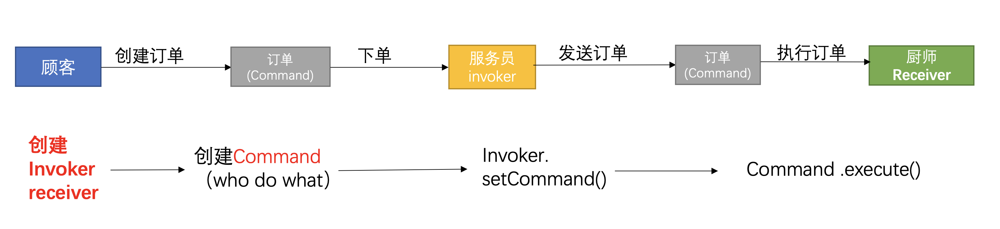
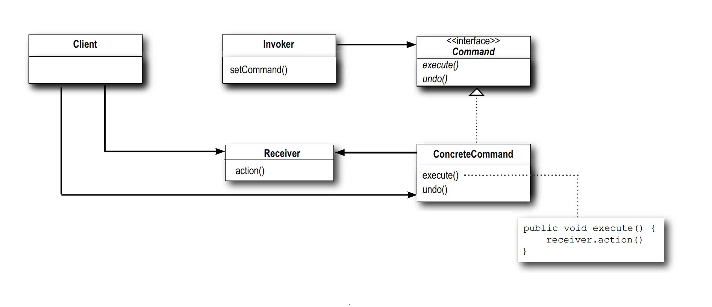
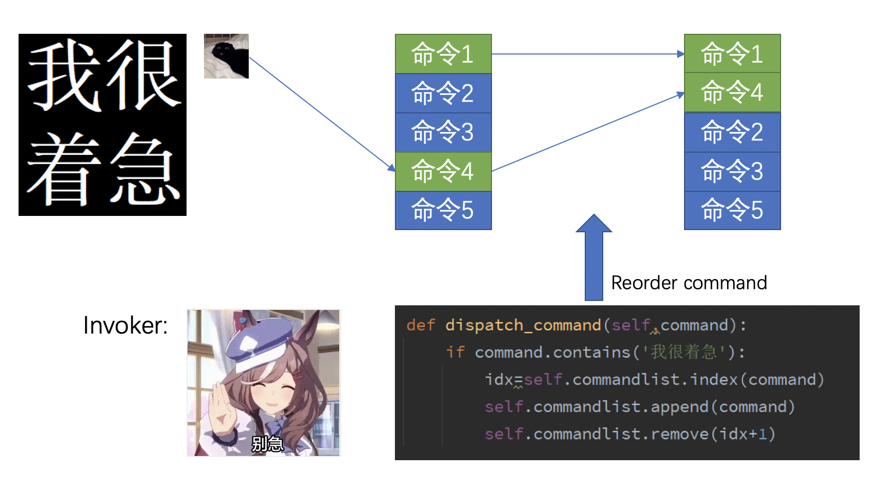
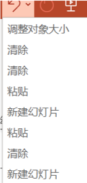
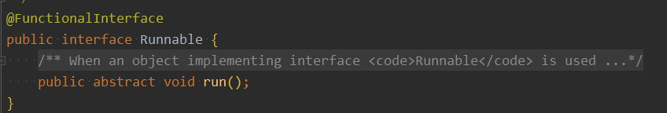
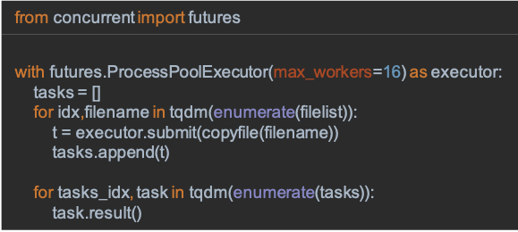

## Chapter 5: Command Pattern 命令模式

</br>

<div align=center>
	
</div>

</br>
在软件设计中，我们经常需要向某些对象发送请求，但是并不知道请求的接收者是谁，也不知道被请求的操作是哪个，我们只需在程序运行时指定具体的请求接收者即可，此时，可以使用命令模式来进行设计，使得请求发送者与请求接收者消除彼此之间的耦合，让对象之间的调用关系更加灵活。

</br>
</br>

> 核心：解耦调用操作的对象(invoker)和提供实现的对象(receiver)

> 解耦后：调用者→命令→接受者

</br>

## 1. Definition

命令模式(Command Pattern)：将一个请求封装为一个对象，从而使我们可用不同的请求对客户进行参数化；对请求排队或者记录请求日志，以及支持可撤销的操作。命令模式是一种对象行为型模式，其别名为动作(Action)模式或事务(Transaction)模式。

</br>

以餐厅点单为例



</br>

## 2. Design UML

</br>



</br>

> 抽象命令类(Command)角色：声明执行命令的接口，拥有执行命令的抽象方法。

</br>

> 具体命令类(Concrete Command)角色：是抽象命令类的具体实现类，它拥有接收者对象，并通过调用接收者的功能来完成命令要执行的操作。

</br>

> 调用者/请求者(Invoker)角色：是请求的发送者，它通常拥有很多的命令对象，并通过访问命令对象来执行相关请求，它不直接访问接收者。

</br>

> 实现者/接收者(Receiver)角色：执行命令功能的相关操作，是具体命令对象业务的真正实现者。

</br>

时序图


</br>

## 3. What else can invoker do

</br>

### i.  集中调度命令


</br>

根据使用场景，invoker可以动态的调整命令执行顺序或者对命令进行预处理。



</br>

### ii. 组合命令

</br>

允许使用组合命令，即将多个命令组合后包装后形成一个新的命令

```Java
interface Command {
    public void execute();
}

class OrderWater implements Command {
    public void execute() {
        // get water
    }
}

class AskForTissue implements Command {
    public void execute() {
        // get tissue
    }
}

class CompoundCommand implements Command {
    Command c1 = OrderWater();
    Command c2 = AskForTissue();

    public void execute() {
        c1.execute();
        c2.execute();
    }
}
```

</br>

### iii. 撤销命令

</br>

invoker 中定义一个存储历史命令的 List/Array，在 Command 中定义 `undo()` 方法。当需要撤销时，**反向遍历**该 List/Array 并调用每个命令的 undo 方法实现撤销命令。



</br>

执行撤销时，invoker 仍可以进行额外选择，比如只撤销新建命令。

</br>

## 4. Example

</br>

interface
```Java
public interface Command {
    public void execute();
}
```

</br>

Command实现类
```Java
public class LightOnCommand implements Command {
    Light light;

    public LightOnCommand(Light light) {
        this.light = light;
    }

    public void execute() {
        light.on();
    }

    public void undo() {
        light.off();
    }
}
```

</br>

Invoker实现
```Java
public class SimpleController {
    Command slot;

    // 构造函数
    public SimpleController() {}

    public void setCommand(Command command) {
        slot = command;
    }

    public void buttonWasPressed() {
        slot.execute();
    }
}
```

</br>

客户使用该遥控器
```Java
// Java主函数
public static void main(String[] args) {
    // 创建invoker
    SimpleController controller = new SimpleController();
    // 创建receiver
    Light light = new Light();
    // 创建command
    LightOnCommand lightOn = new LightOnCommand(light);

    // set命令
    controller.setCommand(lightOn);
    // 执行命令
    controller.buttonWasPressed();
}
```

</br>

## 5. Real Examples

</br>

### i. java.lang.Runnable

</br>



Runnable：任务抽象，也就是“命令”；线程池通过execute调用该run方法

</br>

### ii. Python concurrency.futures

</br>



每一个 task 对象均为一个命令，被添加到 tasks 这个 List 中，通过调用每个 task 的 `result()` 方法执行命令内容。

</br>

## 6. Pros/Cons

</br>

优点
> 1. 低耦合：调用者和接收者之间没有什么直接关系，二者通过命令中的execute接口联系。
> 2. 扩展性好：新命令很容易加入，也很容易拼出“组合命令”。

</br>

缺点
> 如果业务场景中命令比较多，那么对应命令类和命令对象的数量也会增加，这样系统会膨胀得很大。
