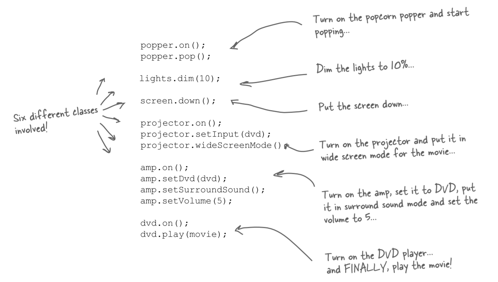
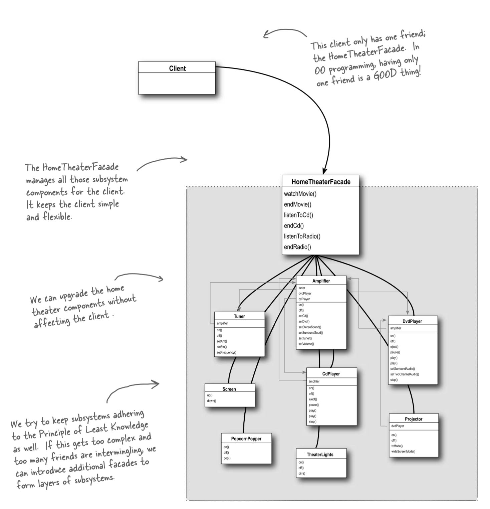

## Chapter 6: Adapter and Facade Patterns  适配器模式与外观模式

</br>

<div align=center>
	
</div>

</br>

## 适配器模式(Adapter Pattern)
## 1. Definition

</br>

适配器模式(Adapter Pattern)将一个类(Class)的接口(Interface)，转换成客户期望的另一个接口。适配器让原本接口不兼容的类可以合作无间。这可以让客户从实现的接口解耦。如果在一段时间之后，我们想要改变接口，适配器可以将改变的部分封装起来，客户就不必为了应对不同的接口而每次跟着修改。适配器模式其实就是一个中间层，起着转化/委托的作用，将一种接口转化为另一种符合需求的接口。


</br>

## 2. Design UML

</br>

### 2.1 Object Adapter


</br>


</br>

> 目标角色(Target)：期望的接口

</br>

> 源角色(Adaptee)：存在于系统中，内容满足客户需求（需转换），但接口不匹配的接口实例

</br>

> 适配器(Adapter)：将源角色(Adaptee)转化为目标角色(Target)的类实例

</br>

这个模式是如何把客户和接口绑定起来，而不是和实现绑定起来，我们同样可以使用数个适配器，每一个都负责转换不同组的后台类。或者，也可以加上新的实现，只要它们遵守目标接口就可以。


</br>

### 2.2 Class Adapter

</br>

“类”适配器需要多重继承才能实现，具体做法是让Adapter实现Target接口并且继承Adaptee，这样Adapter就具备Target和Adaptee的特性，可以将两者进行转化。该适配器与“对象”适配器唯一的差别在于适配器继承了Target和Adaptee，而对象适配器利用组合的方式将请求传送给被适配者。

</br>


</br>

## 3. Design Example

</br>

### 3.1 Duck and Turkey
假设客户需要鸭子，然而现在缺鸭子对象，想用一些火鸡对象来冒充，显而易见，因为火鸡的接口不同，所以不能公然拿来用，这时便需要一个适配器使得火鸡转换为鸭子。


</br>

```Java
public interface Duck {
    public void quack();
    public void fly();
}

public class MallardDuck implements Duck{
    public void quack() {
        System.out.println("Quack");
    }
    public void fly() {
        System.out.println("I'm flying");
    }
}


public interface Turkey{
    public void gobble();
    public void fly();
}

public class WildTurkey implements Turkey{
    public void gobble() {
        System.out.println("Gobble gobble");
    }
    public void fly() {
        System.out.println("I'm flying a short distance");
    }
}
```

</br>

#### 3.1.1 Adapter

Adapter是一个实现了Target接口的具体类，而quack()等方法是我们在外部想要调用的方法。通过构造函数传入Adaptee(即turkey)类型的私有成员变量，委托给Adaptee实现具体方法。表面上我们调用的是Adapter的quack()方法，实际最后调用的是Adaptee的gobble()方法。

</br>

```Java
public class TurkeyAdapter implements Duck{
    Turkey turkey;

    public TurkeyAdapter(Turkey turkey) {
        this.turkey = turkey;
    }
    public void quack() {
        turkey.gobble();
    }
    public void fly() {
        for(int i=0; i < 5; i++) {
            turkey.fly();
        }
    }
}

public class DuckTestDrive {
    public static void main (String[] args) {
        MallardDuck duck = new MallardDuck();

        WildTurkey turkey = new WildTurkey();
        Duck turkeyAdapter = new TurkeyAdapter(turkey); 
        
        System.out.println(“The Turkey says...”); 
        turkey.gobble(); 
        turkey.fly();

        System.out.println(“\nThe Duck says...”); 
        testDuck(duck);

        System.out.println(“\nThe TurkeyAdapter says...”); 
        testDuck(turkeyAdapter);
    }

    static void testDuck(Duck duck) { 
        duck.quack();
        duck.fly();
    }
}
```

</br>

#### 3.1.2 Class and Object Adapters


</br>


</br>


### 3.2  Enumerator and Iterator
</br>
早期的Java集合(collection)类型都实现了一个名为elements()的方法，该方法会返回一个Enumeration(举)。这个Enumeration接口可以逐一走过此集合内的每个元素，而无需知道它们在集合内是如何被管理的。而当Sun推出更新后的集合类时，开始使用了Iterator(迭代器)接口，这个接口和枚举接口很像，都可以让你遍历此集合类型内的每个元素，但不同的是，迭代器还提供了删除元素的能力。当我们面对遗留代码时会出现枚举器接口，但我们有希望在新代码中只使用迭代器，这时便可以使用适配器

</br>


#### 3.2.1  Design the Adapter

</br>

我们需要一个适配器实现目标接口，而此目标接口是由被适配者所组合的。hasNext()和next()方法很容易实现，直接把它们从目标对应到被适配者就可以了，对于Iterator多出的remove()方法，将它定义成会抛出UnsupportedOperationException。

</br>


</br>

```Java
public class EnumerationIterator implements Iterator { 
    Enumeration enum;

    public EnumerationIterator(Enumeration enum) {
        this.enum = enum;
    }

    public boolean hasNext() { 
        return enum.hasMoreElements();
    } 
    public Object next() { 
        return enum.nextElement();
    }
    public void remove() {
        throw new UnsupportedOperationException();
    }
}
```

</br>

## 4. Pros/Cons

</br>

优点
> 1. 客户端通过适配器可以透明地调用目标接口。
> 2. 复用了现存的类，程序员不需要修改原有代码而重用现有的适配者类。
> 3. 将目标类和适配者类解耦，解决了目标类和适配者类接口不一致的问题。
> 4. 在很多业务场景中符合开闭原则。

</br>

缺点
> 1. 适配器编写过程需要结合业务场景全面考虑，可能会增加系统的复杂性。
> 2. 增加代码阅读难度，降低代码可读性，过多使用适配器会使系统代码变得凌乱。


</br>

## 5. Differences between the Decorate Pattern and the Adapter Pattern

</br>

#### 装饰者模式
> 在不改变原类文件和使用继承的情况下，动态地扩展一个对象的功能，通过创建一个包装对象，也就是装饰来包裹真实的对象。因为装饰器只是增强了原类文件的功能，所以装饰器类和原类文件的接口应该是一样的

</br>

#### 适配器模式
> 适配器模式是用新接口来调用原接口，原接口对新系统来说是不可见或者说不可用的。

</br>

</br>

</br>


## 外观模式(Facade Pattern)
## 1. Definition

</br>

外观模式(Facade Pattern)提供了一个统一的接口，用来访问子系统中的一群接口，外观定了一个高层接口，让子系统更容易使用。使用外观模式时，我们创建了一个统一的类，用来包装子系统中一个或多个复杂的类，客户端可以直接通过外观类来调用内部子系统中方法，从而外观模式让客户和子系统之间避免了紧耦合。


</br>

## 2. Design UML

</br>


</br>

> 客户端(Client)：外观接口调用测试者。

</br>

> 外观类(Facade)：提供统一的调用接口，外观类知道哪些子系统负责处理请求，从而将调用端的请求代理给相应子系统对象。

</br>

> 子系统(Subsystem)：处理Facade对象指派的任务，是功能的实际提供者。

</br>


## 3. Design Example

</br>

假设我们需要构建一个家庭影院，内含DVD播放器、豪华灯光、投影机等等设备，拥有很多类与接口需要我们去学习使用

</br>


</br>

若是我们想要好好地享受下电影，在看电影前需要执行一些任务，包括将灯光调暗、放下屏幕、打开投影机等等一系列任务。外观模式的出现便是为了简化这一系列繁琐的操作。

</br>

### 3.1 Without Facade Pattern

</br>



在看电影前的操作涉及到很多类，且一旦决定要升级影音系统，可能还需要重新学习一套稍微不同的操作过程。

</br>

### 3.2 With Facade Pattern

</br>

有了外观模式，通过实现一个提供更合理的接口的外观类，你可以将一个复杂的子系统变得容易使用。同时，如果需要复杂子系统的强大威力依然可以使用原来的复杂系统；而如果需要一个方便使用的接口，那就是用外观类。具体执行的过程有点类似ios的快捷指令功能。

</br>


</br>

```Java
public class HomeTheaterFacade { 
    Amplifier amp; 
    Tuner tuner; 
    DvdPlayer dvd; 
    CdPlayer cd; 
    Projector projector; 
    TheaterLights lights; 
    Screen screen; 
    PopcornPopper popper;
    public HomeTheaterFacade(Amplifier amp, 
                Tuner tuner, 
                DvdPlayer dvd, 
                CdPlayer cd, 
                Projector projector, 
                Screen screen, 
                TheaterLights lights, 
                PopcornPopper popper) {
        this.amp = amp; 
        this.tuner = tuner; 
        this.dvd = dvd; 
        this.cd = cd; 
        this.projector = projector; 
        this.screen = screen; 
        this.lights = lights; 
        this.popper = popper;
    } 
    // other methods here
}

public void watchMovie(String movie) { 
    System.out.println(“Get ready to watch a movie...”); 
    popper.on(); 
    popper.pop(); 
    lights.dim(10); 
    screen.down(); 
    projector.on(); 
    projector.wideScreenMode(); 
    amp.on(); 
    amp.setDvd(dvd); 
    amp.setSurroundSound(); 
    amp.setVolume(5); 
    dvd.on(); 
    dvd.play(movie);
}

public void endMovie() { 
    System.out.println(“Shutting movie theater down...”); 
    popper.off(); 
    lights.on(); 
    screen.up(); 
    projector.off(); 
    amp.off(); 
    dvd.stop(); 
    dvd.eject(); 
    dvd.off();
}

public class HomeTheaterTestDrive { 
    public static void main(String[] args) { 
        // instantiate components here

        HomeTheaterFacade homeTheater = 
                new HomeTheaterFacade(amp, tuner, dvd, cd, 
                        projector, screen, lights, popper);

        homeTheater.watchMovie(“Raiders of the Lost Ark”); 
        homeTheater.endMovie(); 
    }
}
```
</br>

## 4. Pros/Cons

</br>

优点
> 1. 外观模式对客户屏蔽了子系统组件，从而简化了接口，减少了客户处理的对象数目并使子系统的使用更加简单。
> 2. 减少系统相互依赖

</br>

缺点
> 1. 如果增加新的子系统可能需要修改外观类或客户端的源代码，这样就违背了”开闭原则“。


</br>

## 5. The Principle of Least Knowledge

</br>

最少知识(Least Knowledge)原则：只和你的密友谈话。
当你正在设计一个系统，不管是任何对象，你都要注意它所交互的类有哪些，并注意它和这些类是如何交互的。这个原则希望我们在设计中，不要让太多的类耦合在一起，免得修改系统中一部分，会影响到其他部分。如果许多类之间相互依赖，那么这个系统就会变成一个易碎的系统，它需要花许多成本维护，也会因为太复杂而不容易被其他人了解。
</br>
这个原则提供了一些方针：就任何对象而言，在该对象的方法内，我们只应该调用属于以下范围的方法：
1. 该对象本身
2. 被当作方法的参数而传递进来的对象
3. 此方法所创建或实例化的任何对象
4. 对象的任何组件
</br>

### 5.1 Example

</br>


</br>

### 5.2 The Facade and the Principle of Least Knowledge

外观模式中最少知识原则的体现



</br>
