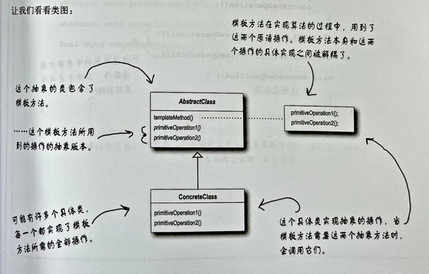
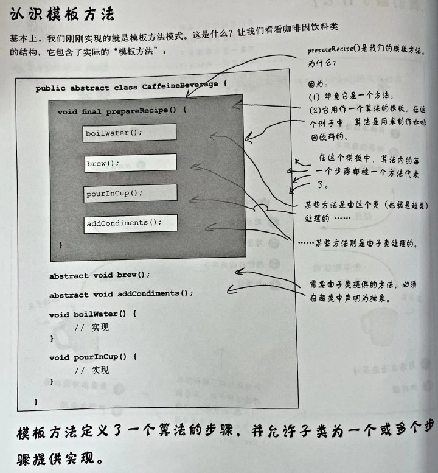

## Chapter 7: Template Pattern  模板方法模式

</br>

<div align=center>
	
</div>

</br>

## 模版模式(Template Pattern)
## 1. Definition

</br>

1.1模板方法模式：在一个方法中定义一个算法的骨架，而将一些步骤延迟到子类中。模板方法使得子类可以在不改变算法结构的情况下，重新定义算法中的某些步骤。



1.2 钩子是一种被声明在抽象类中的方法，但只有空或默认的实现。钩子的存在，可以让子类有能力对算法的不同点进行挂钩。要不要挂钩，由子类自行决定。对模板方法进行挂钩


## 2. Design Example

</br>

### 2.1 煮咖啡和煮茶叶
在现实世界中，星巴克咖啡的冲泡方法如下：
把水煮沸
用沸水冲泡咖啡
把咖啡倒进杯子
加糖和牛奶

茶的冲泡方法如下：
把水煮沸
把沸水浸泡茶叶
把茶倒进杯子
加柠檬
咖啡和茶的冲泡方法大致上一样，因此，使用模板方法抽取咖啡和茶。



定义模板方法prepareRecipe()
​</br>

```Java
public abstract class CaffeineBeverage {
  
    final void prepareRecipe() {
        boilWater();
        brew();
        pourInCup();
        addCondiments();
    }
 
    abstract void brew();
  
    abstract void addCondiments();
 
    void boilWater() {
        System.out.println("Boiling water");
    }
  
    void pourInCup() {
        System.out.println("Pouring into cup");
    }
}
```
</br>
​定义咖啡 Coffee 类：重写部分流程操作流程
​</br>

```Java
​
public class Coffee extends CaffeineBeverage {
    public void brew() {
        System.out.println("Dripping Coffee through filter");
    }
    public void addCondiments() {
        System.out.println("Adding Sugar and Milk");
    }
}
```
</br>
定义咖啡 Tea 类：重写部分流程操作流程

```Java
​
public class Tea extends CaffeineBeverage {
    public void brew() {
        System.out.println("Steeping the tea");
    }
    public void addCondiments() {
        System.out.println("Adding Lemon");
    }
}
```
</br>
测试：
​​</br>

```Java
public class BeverageTestDrive {
    public static void main(String[] args) {
 
        Tea tea = new Tea();
        Coffee coffee = new Coffee();
 
        System.out.println("\nMaking tea...");
        tea.prepareRecipe();
 
        System.out.println("\nMaking coffee...");
        coffee.prepareRecipe();
    }
}
```
</br>

钩子是一种被声明在抽象类中的方法，但只有空或默认的实现。钩子的存在，可以让子类有能力对算法的不同点进行挂钩。要不要挂钩，由子类自行决定。对模板方法进行挂钩：customerWantsCondiments() 钩子函数
​​</br>

```Java
public abstract class CaffeineBeverageWithHook {
 
    final void prepareRecipe() {
        boilWater();
        brew();
        pourInCup();
        // 通过钩子函数决定是否调用该抽象方法。
        if (customerWantsCondiments()) {
            addCondiments();
        }
    }
 
    abstract void brew();
 
    abstract void addCondiments();
 
    void boilWater() {
        System.out.println("Boiling water");
    }
 
    void pourInCup() {
        System.out.println("Pouring into cup");
    }
 
    // 钩子函数，可决定某个抽象方法是否需要调用
    boolean customerWantsCondiments() {
        return true;
    }
}
```
</br>

​​</br>

子类重写钩子函数的逻辑 CaffeineBeverageWithHook.customerWantsCondiments()：
```Java

​
import java.io.BufferedReader;
import java.io.IOException;
import java.io.InputStreamReader;
​
public class CoffeeWithHook extends CaffeineBeverageWithHook {
 
    public void brew() {
        System.out.println("Dripping Coffee through filter");
    }
 
    public void addCondiments() {
        System.out.println("Adding Sugar and Milk");
    }
 
    public boolean customerWantsCondiments() {
​
        String answer = getUserInput();
​
        if (answer.toLowerCase().startsWith("y")) {
            return true;
        } else {
            return false;
        }
    }
 
    private String getUserInput() {
        String answer = null;
​
        System.out.print("Would you like milk and sugar with your coffee (y/n)? ");
​
        BufferedReader in = new BufferedReader(new InputStreamReader(System.in));
        try {
            answer = in.readLine();
        } catch (IOException ioe) {
            System.err.println("IO error trying to read your answer");
        }
        if (answer == null) {
            return "no";
        }
        return answer;
    }
}

```
</br>

​​</br>
## 4. 总结

</br>

总结：
模板方法定义了算法的步骤，把这些步骤的实现延迟到了子类模板方法提供了一种代码复用的技巧模板方法的抽象可以定义抽象方法、具体方法和钩子。钩子是一种方法，它在抽象类中不做任何事情 ，或者只做默认的事情，子类可以选择要不要去覆盖它。为防止子类修改模板方法，可以将模板方法定义为final。将决策权放在高层模块中，以便决定何时调用底层组件，即模板方法中使用钩子函数判断是否调用某个方法。当子类“必须”提供算法中的某个方法或步骤的实现时，就使用抽象方法。如果算法的这个部分是可选的，就用钩子。

</br>
