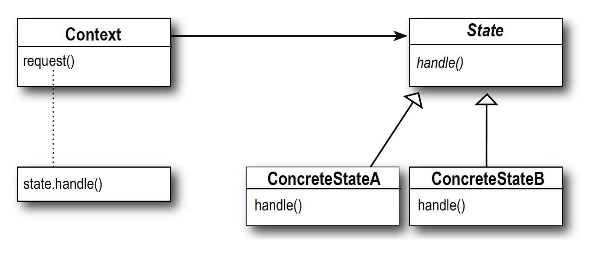

## Chapter 9: State Pattern  状态模式

</br>

<div align=center>
	
</div>

</br>
</br>

## 1. Definition

</br>

类的行为是基于它的状态改变的。这种类型的设计模式属于行为型模式。

状态模式主要解决的是当控制一个对象状态的条件表达式过于复杂时的情况。把状态的判断逻辑转移到表示不同状态的一系列类中，可以把复杂的判断逻辑简化。

在状态模式中，我们创建表示各种状态的对象和一个行为随着状态对象改变而改变的 context 对象。

</br>

## 2. Design UML

</br>



</br>

> 具体状态所有者(Concrete Context)角色：持有所有可能的状态，成员变量 state 指向当前状态。可调用 state.handle() 执行当前状态。

</br>

> 抽象状态(State Interface)角色：定义状态的接口，状态所有者 Context 中的成员变量 State 的 type 为此接口。

</br>

> 具体状态(Concrete State)角色：具体定义的状态，实现了 handle() 函数来执行当前状态。

</br>

## 3. Design Example

</br>

考虑这样的一个场景：一个电梯，有四种操作:运行、停止、开门、关门。每一种操作成功后，都对应着状态的切换。每一种状态，又可以随着操作，向另一种状态切换。状态与状态之间的切换需要遵循 state machine。如下表所示:

</br>


</br>

### i. 错误示范

</br>

使用 `enum` 和 `if else` 来定义和转换状态

</br>

```Java
public enum ElevatorState {
    // 开门状态
    Opening,

    // 关门状态
    Closed,

    // 运行状态
    Running,

    // 停止状态
    Stopped,
}
```

</br>

Context主体

```Java
public class Elevator {
    private ElevatorState state = ElevatorState.Closed;

    public void open() {
        if (state == ElevatorState.Opening) {
            // Error: 无法重复开门
        } else if (state == ElevatorState.Closed) {
            state = ElevatorState.Opening;
            // 开门
        } else if (state == ElevatorState.Running) {
            // Error: 运行状态下不能开门
        } else if (state == ElevatorState.Stopped) {
            state = ElevatorState.Opening;
            // 开门
        }
    }

    public void close() {
        if (state == ElevatorState.Opening) {
            state = ElevatorState.Closed;
            // 关门
        } else if (state == ElevatorState.Closed) {
            // Error: 无法重复关门
        } else if (state == ElevatorState.Running) {
            // Error: 运行状态下，就一定是关门状态了
        } else if (state == ElevatorState.Stoped) {
            // Error: 停止后就是关门状态了
        }
    }

    public void run() {
        if (state == ElevatorState.Opening) {
            // Error: 电梯门没关，不能运行
        } else if (state == ElevatorState.Closed) {
            state = ElevatorState.Running;
            // 运行
        } else if (state == ElevatorState.Running) {
            // Error: 无法重复运行
        } else if (state == ElevatorState.Stoped) {
            state = ElevatorState.Running;
            // 运行
        }
    }

    public void stop() {
        if (state == ElevatorState.Opening) {
            // Error: 开门状态下不会运行，自然也不需要停止
        } else if (state == ElevatorState.Closed) {
            // Error: 关门状态下不会运行，自然也不需要停止
        } else if (state == ElevatorState.Running) {
            state = ElevatorState.Stoped;
            // 停止
        } else if (state == ElevatorState.Stoped) {
            // Error: 无法重复停止
        }
    }
}
```

</br>

大量的条件判断，重复代码太多了。当状态数量更多后，逻辑会变得很复杂。

</br>

ii. State Pattern

</br>

电梯状态可以作为电梯的一个属性：
1. 新建一个电梯状态的抽象类，定义4个操作: 打开、关闭、停止、运行。
2. 新建四个电梯状态的子类
3. 每个实际状态，自己判断能否向目标状态切换。如果能切换的话，创建目标状态对象，并向电梯发送修改状态的请求

</br>


</br>

电梯 (Concrete Context)

```Java
public class Elevator {
    private ElevatorState state = new ClosedState();

    public ElevatorState getState() {
        return state;
    }

    public void setState(ElevatorState state) {
        this.state = state;
    }

    public void open() {
        state.open(this);
    }

    public void close() {
        state.close(this);
    }

    public void run() {
        state.run(this);
    }

    public void stop() {
        state.stop(this);
    }
}
```

</br>

Concrete State: opening state

```Java
public class OpeningState extends ElevatorState {
    @Override
    public void open(Elevator elevator) {
        // Error: 无法重复开门
    }

	@Override
    public void close(Elevator elevator) {
        elevator.setState(new ClosedState());
        // 关门
    }

    @Override
    public void stop(Elevator elevator) {
        // Error: 开门状态下不会运行，自然也不需要停止
    }

    @Override
    public void run(Elevator elevator) {
        // Error: 电梯门没关，不能运行
    }

}
```

</br>

电梯具备一个电梯状态对象，当接收到操作请求时，电梯对象本身不做任何的判断和处理，而是交由状态对象处理。这种实现方式，电梯与电梯状态产生了双向依赖，属于一种紧耦合 (tight coupling)

</br>

## 4. Pros and Cons

</br>

### i. 优点

</br>

1. 封装了转换规则，转换由 具体状态 类实现。
2. 将所有与某个状态有关的行为放到一个类中，并且可以方便地增加新的状态。
3. 可以让多个环境对象共享一个状态对象，从而减少系统中对象的个数。

</br>

### ii. 缺点

</br>

1. 状态模式对"开闭原则"的支持并不太好(紧耦合)，对于可以切换状态的状态模式，增加新的状态类需要修改那些负责状态转换的源代码。
2. 状态模式的使用必然会增加系统类和对象的个数。